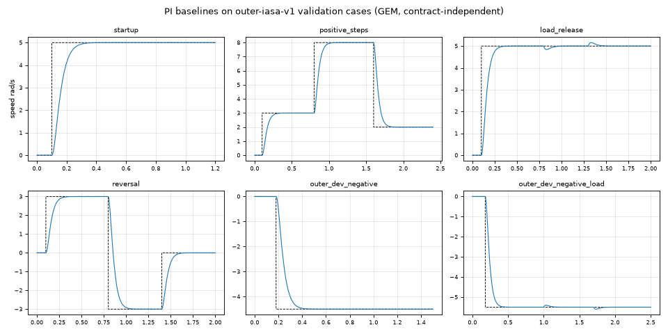
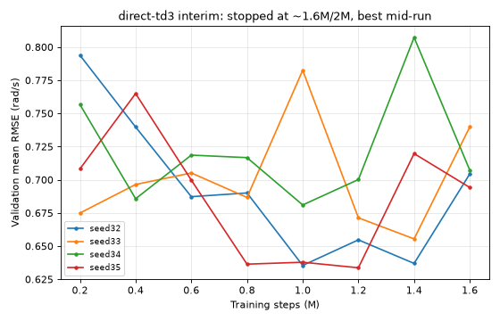
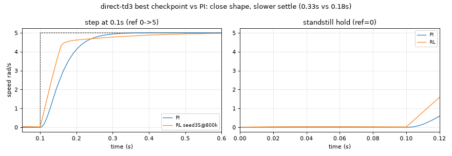
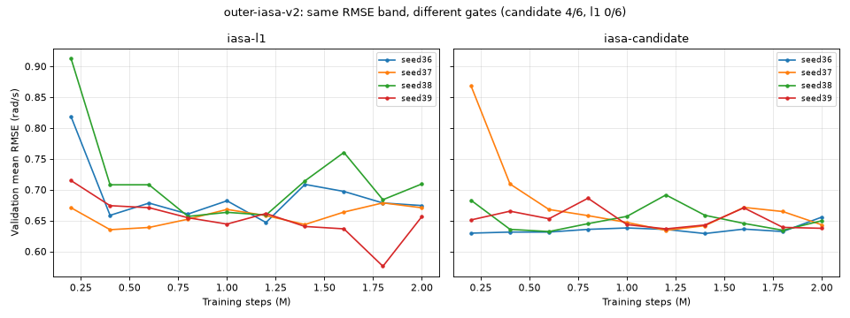
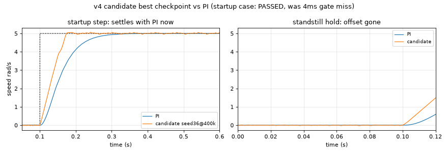

# Visible results: speed-loop lineage

Simulation only; plant parameters assumed, not measured. Raw traces stay in
ignored `results/`; this page shows key graphs only.

## Inner current controller (frozen)

`outer-inner-freeze-v1` DDPG current loop, 10 kHz, qualified in
`current-loop-final` (q-step at fixed speed):

| Speed (rad/s) | dq RMSE (A) | Peak phase I (A) | Rise 10-90% | Settle | Overshoot |
|---:|---:|---:|---:|---:|---:|
| 0 | ~0.00 | 1.39 | 77 us | 0.20 ms | 4.0% |
| 10 | 0.06 | 1.42 | — | — | — |
| 20 | 0.17 | 1.51 | — | — | — |

Full table in `current-loop-final/metrics.json`. Frozen artifact
`outer-iasa-v1/inner_model.zip` is hash-pinned by the outer protocol.

## PI baselines (outer validation cases, GEM)

Contract-independent (PI uses its own loop). 6 cases, all complete:

Per-case metrics: `outer-iasa-v1/baselines-iasa-td3/metrics.json`.

## Architectures: repaired direct vs IASA

`outer-iasa-v1`: `direct-td3` (scalar, 7-obs v2) vs `iasa-td3` (two-output,
19-obs v3), 4 seeds each (32-35), 250k/env x 8 envs, Warp trains / GEM judges.

**Direct interim (wave stopped early at ~1.6M/2M):** RMSE falls to ~0.65 by
~1M steps then plateaus; best checkpoints are mid-run, not final.

Best direct checkpoint (seed35 @800k) tracks PI shape but settles slower
(0.33s vs 0.18s on the startup step — misses the 1.5x+50ms gate by ~4ms)
and holds a ~0.026 rad/s standstill offset. No sustained oscillation:
tail ripple pp ~0.03 rad/s at 5 rad/s reference.

Score: `passed 0/6` all direct seeds (settling/tail/peak-current gates).

## Reward stage: outer-iasa-v2 (completed 2026-09-23)

Reward-only change, 2 arms x 4 fresh seeds (36-39), 250k/env. Winner:
**`iasa-candidate`**. Full queue 8/8 clean, `failed 0`.

| arm | best RMSE | violations/seed | passed |
|---|---|---|---|
| iasa-l1 (v3) | 0.64-0.71 | 12-20 | 0/6 all seeds |
| iasa-candidate (v4) | 0.63-0.65 | 2 | 4/6 all seeds |

Same RMSE band, different gates. L1 fails on settling everywhere (slow
transients + standstill offset) plus peak current; candidate settles with PI
and holds — the log-tracking + no-current-penalty change did exactly what
sect.3 predicted. Remaining candidate failures are `peak_current` on
`reversal` and `outer_dev_negative` only.

Next lever for the last two cases: peak-current behavior under reversal/dev
events (action-structure or current-guard change — new screen, not a tweak
of this one).

## Reproduce

- Parity gates: `.venv/bin/python -W ignore -m pytest warp_backend/test_iasa.py rl/outer/test_contract.py -q`
- Clean viewer per run: `python ui/render.py --run <results/bldc/study> --out /tmp/vroom-ui`
- Benchmark numbers: `docs/benchmark.md`
